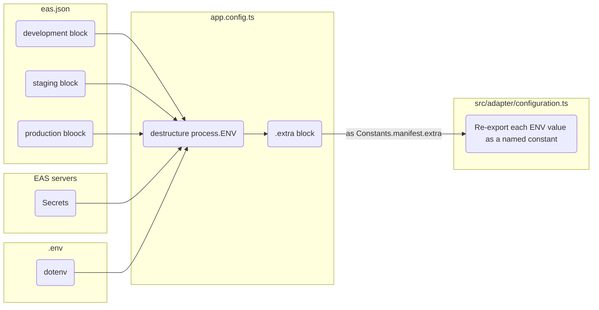
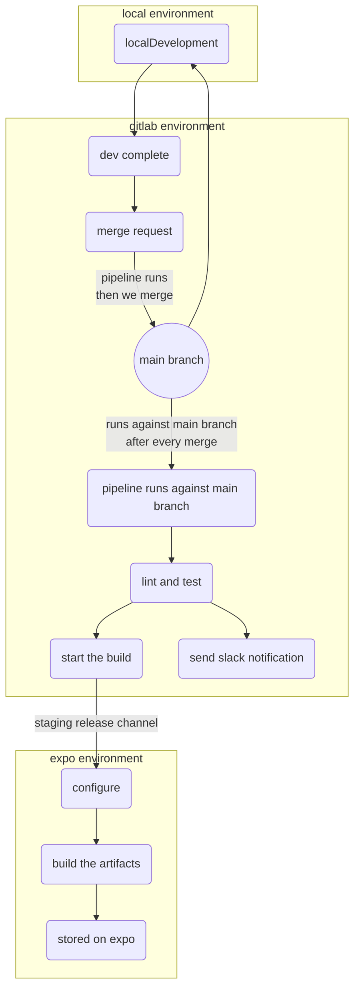
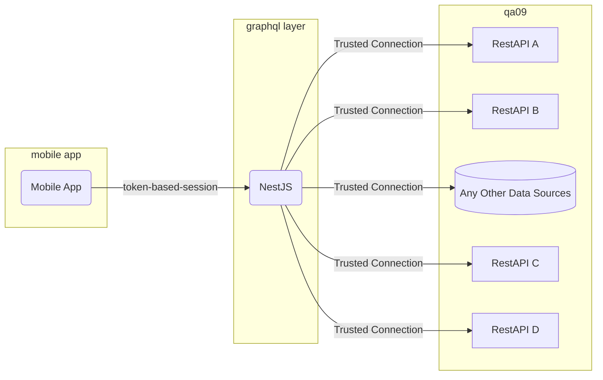
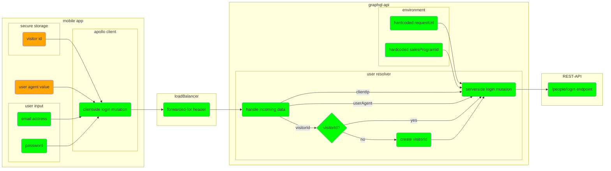
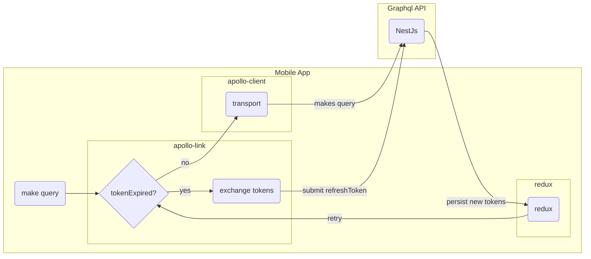
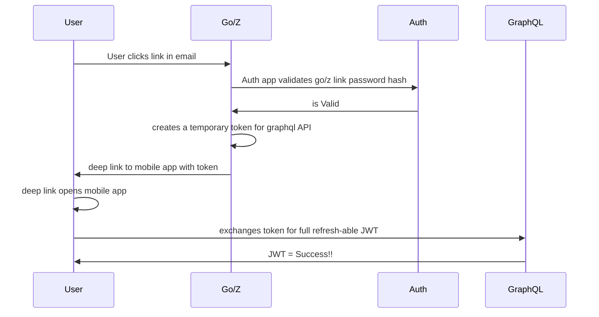
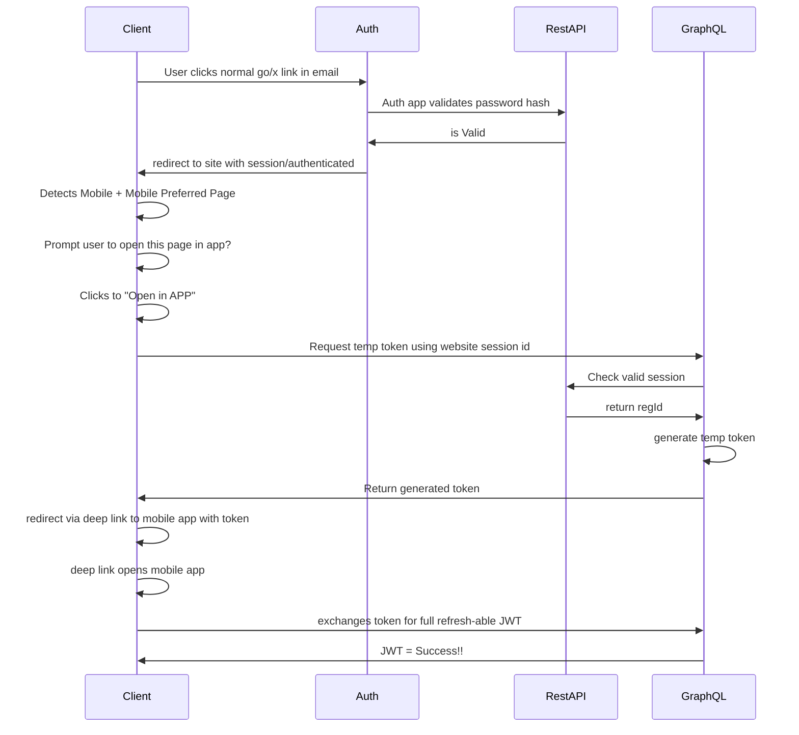

# Classmates Mobile App

* [Prerequisites](#prerequisites)
* [Installation](#installation)
* [Configuration](#configuration)
* [Running](#running)
* [Building](#building-standalone-apps)
* [Updating](#updating)
* [Contributing](#contributing)
* [Explanations](#explanations)
* [API connection](#fetching-data)
* [Yarn Commands](#yarn-commands)
* [Testing](#testing)
* [Debugging](#debugging)
* [Running a Simulator](#running-a-simulator)

## Prerequisites

  **Note:** Due to EAS build system requirements, we lock our node version to `~14.8.1`.

  * MacOs >= Big Sur
  * Node 16.20.x ( nvm install v16.20 && nvm use 16.20 )
  * Yarn ( `npm i -g expo-cli yarn` )
  * XCODE ( Optional. Used for IOS Simulator )
  * Android Studio ( Optional. Used for Android Simulator )
  * [Graphql-api](https://gitlab.com/classmates/graphql-api) ( configured in `.env`)

## Installation

Get the code and install dependencies.

```
git clone git@gitlab.tuk2.intelius.com:classmates/mobile-app.git $HOME/Sites/mobile-app
cd $HOME/Sites/mobile-app && yarn
```

[Then configure the app](#configuration).

## Configuration

* [local configuration](#local-env-configuration)
* [eas configuration](#eas-env-configuration)
1. verify-node - this ensures we are running the appropriate version of Node.
2. install - this step installs all dependencies.
3. write-env - a script writes the required `.env` file. You must configure this file to run the project.
4. google-services - a script writes the required Google Services Config Files. You will need this files for using google analytics.


When making changes to the the `.env` file, a clean restart is required. Use `yarn start:clean` to do this.

### How it works

At build kickoff, we set configuration via the `ENV`. This gets fed into `app.config.ts`, which writes to [expo-constants](https://docs.expo.dev/versions/latest/sdk/constants/). The values are then re-exported in`src/adapters/configuration.ts`. At runtime, consumers access these values.

### Why do we go through all of that?
When the app build kicks off, the app writes device specific configuration files via app.config.ts. This is the only point in the build process that will have access to configuration. As part of the build process, it links configuration nativly. After the build, upstream javascript components do not have direct access to the ENV. (If you `console.log(process.env))` you will see it's empty.


### Local ENV configuration

Locally we use [dotenv](https://github.com/motdotla/dotenv) for configuration and secrets. Create a `.env` file in the project root. Add ENV values in `KEY=value` format. No quotes required. This file is listed in  .gitignore` and does not belong in source control.

### EAS ENV configuration

__DO NOT ADD SECRETS TO `eas.json` !__ [See this section for adding secrets.](https://docs.expo.dev/build-reference/variables/#adding-secrets-with-eas-cli)

Configuration on higher environments is set via `eas.json`. [Read this for more on eas.json](https://docs.expo.dev/build-reference/variables/#using-plaintext-environment-variables). This configuation belongs in source control, and should not contain secrets, such API keys. [To add secrets please use the `eas secrets:create` CLI tool](https://docs.expo.dev/build-reference/variables/#adding-secrets-with-eas-cli).

### Known ENV options

| Name                      | type          | required | description                                                                                     |
| ---                       | ---           | ---      | ---                                                                                             |
| `API_URL`                 | string        | yes      | fully qualified graphql endpoint                                                                |
| `TEST_USER_EMAIL`         | string        | no       | If provided sign in screen will auto fill with this value                                       |
| `GOOGLE_SERVICES_ANDROID` | base64 string | no       | google-services.json cyphered as base64 string, if not set, Google analytics will not work      |
| `GOOGLE_SERVICES_IOS`     | base64 string | no       | GoogleService-Info.plist cyphered as base64 string, if not set, Google analytics will not work  |
| `MAGENTO_COMMERCE_UPGRADE_URL` | string   | yes      | This is the URI that upgrade buttons will open                                                  |
| `APP_ENV`                 | string        | yes      | the environment name. staging | development | production                                        |

__Important: When making changes to the the `.env` file, a clean restart is required. Use `yarn start:clean` to do this.__

### Google Services Config Files

If you have downloaded config files for Android and iOS by yourself (google-services.json and GoogleService-Info.plist), you can put these files on the project root directory directly.

If you have existing files, you can export its contents using the `google-services` script

```bash
./bin/google-services --export
or
./bin/google-services -e
```
this will export its contents as showing next
```
GOOGLE_SERVICES_ANDROID=BASE64STRING
GOOGLE_SERVICES_IOS=BASE64STRING
```

You can copy the texts and include it into the `.env` file.

If you already have set the environment variables `GOOGLE_SERVICES_ANDROID` and `GOOGLE_SERVICES_IOS` and don't have the Google Services Configuration Files on your root directory, you can generate the files executing next command

```bash
./bin/google-services
```

__IMPORTANT__: The `google-services` script will be automatically called by the `write-env` script if the environment variables `GOOGLE_SERVICES_ANDROID` and `GOOGLE_SERVICES_IOS` are already set.
## Running

Leveraging expo is the fastest way to run the project.

**If running locally:** You [need to configure graphql-api](https://gitlab.com/classmates/graphql-api), in the `.env`.

```
cd $HOME/Sites/mobile-app && yarn start
```

## Building Standalone Apps

* [prerequisites](#build-prerequisites)
* [version first](#version-first)
* [build IOS](#ios-build-process)
* [build Android](#android-build-process)
* [notifications](#post-build-notifiications)

### Build Prerequisites

When Android and IOS share versions and build numbers, it is easier to discuss and track platforms and changes. This is why **versions are managed by yarn**. App config will parse and pull versioning from `package.json`.

You must have `eas-cli` installed and up to date to create builds on expo.io.

* `yarn global add eas-cli`

### TLDR

Assuming we want to release the main branch.

```
# Get to the right folder / branch
cd ~/Sites/mobile-app && git checkout main

# Pull in the most recent changes
git pull origin master

# Version package.json, git and the changelog
yarn release

# commit and continue
git add package.json CHANGELOG.md && git commit

# push the main branch back to gitlab
git push origin main --follow-tags

# build on expo.io with EAS cli
eas build -p <ios|android> --profile <production|staging|devclient> --auto-submit
```

To start a build, version it with `yarn release`. Fill out the prompt. The buildNumber is critical. This will version `package.json` and appropriately tag the repo. Then push the tag to gitlab. [Read more about versioning here](#versioning).

Next, trigger a build, either through the gitlab pipeline or using the EAS CLI tool. [Read more about that here](#build-second).

### Versioning

`package.json` must be formatted as follows `vA.B.C-D`. `A`, `B`, and `C` represent major, minor, and patch. The buildNumber, `D` is critical. Build numbers need to be maintained consistantly across versions. Any buildNumbers already uploaded to Expo, IOS or Android will be rejected, regardless of the SEMVAR.

For example, if you upload `0.0.1-10` to android, Then 2 months later upload `2.0.9-10`. It will be rejected. The `buildNumber` is the property android uses to apply updates. It must be unique. Ironiquly Apple will not let you submit a version when SEMVAR is older than the live store version. It is easiest to increment both IOS and android at the same time. The same git sha should carry the same version across platforms.

Then submit the build to the appropriate store.

### Build second

TLDR, after we have a properly tagged and versioned build, we upload to build servers on Expo. Those artifacts then get submitted to stores.

#### IOS Build Process

Run `eas build -p IOS --profile production --auto-submit`. This triggers a build on expo.io, and immediately submits a successful build to apple. You still need to go into appstoreconnect.com's testFlight section to finalize 'paperwork' for each build.

#### Android Build Process

Run `eas build -p android --profile production`. Auto-submit does not work for android. After the build, we need to navigate to the build page, download the .apk bundle. Create a release on google play store, and upload that bundle to the google play store.

### Post Build Notifiications

A webhook is fired when the build is completed. This notifies to the [#cm-mobile-app room](https://peopleconnectus.slack.com/archives/C01S0SPM4F8). For more help on webhooks, run `eas webhook --help` in the command line, or [visit eas webhooks](https://docs.expo.dev/eas/webhooks/).

## Releasing

After a successful build, and approval, release through the appropriate store. When finished, merge main into the production branch. This makes it easier to test future graphql-api releases. QA can check out production, and regress it, without looking up version numbers from the stores.

```
# merge main into the production branch post release
git checkout production && git merge main
```

## Updating

* [Node.js](#nodejs)
* [Expo SDK](#expo-sdk)
* [Dependencies](#dependencies)
* [Deduping](#deduping)

### Node.JS

This project tries to stay current with node LTS releases. We restrict the node version with an `.nvmrc` file. On Gitlab, we use an official LTS-current image, [node:latest](https://hub.docker.com/_/node). As that image gets updated, the version inside `.nvmrc` needs to be bumped, to match. This ensures development takes place on the same version as the build.

### Expo SDK

It's very important to keep the expo SDK up to date. Expo releases quarterly, and these releases can be difficult to implement. If the framework falls behind, there may be significant bugs on Mobile OS's. __Keep expo up to date!__ [Refer to this for updating the SDK](https://docs.expo.io/workflow/upgrading-expo-sdk-walkthrough/).

#### Troubleshooting
Use `yarn expo:upgrade`, it wraps `EXPO_DEBUG=true expo upgrade` and leverages `expo-cli` as defined in package.json / node_modules. Sometimes ( expecially with .nvm ) managing global `expo-cli` upgrades can be tricky, annoying, and an extra layer of complexity. This avoids that kerfluffle. In addition if the upgrade hangs, the `EXPO_DEBUG` flag will help you figure out why.

### Dependencies

Yarn comes with `yarn outdated`. We can use this command to keep project dependencies updated. At least weekly, we should check for updates, and run `yarn upgrade <package.name>` to update. Optionally, you can pass a `--latest` flag to `outdated` if necessary. After updating, we should run [`yarn deduplicate`](#deduping), and then re-run `yarn outdated` to see if anything was undone.

__Never update these packages, willy nilly__ They are normally specific to the version of Expo SDK that we use.

* [react](https://reactjs.org/)
* [react-dom](https://reactjs.org/)
* [react-native](https://github.com/expo/react-native/archive/sdk-42.0.0.tar.gz)
* [react-native-web](https://github.com/necolas/react-native-web#readme)

### Deduping

After updating node dependencies, we should run `yarn deduplicate`, to consolidate multiple version of the same pkg, that may have been required by dependencies. Sometimes this may roll back an upgrade you've just done. This normally happens when our dependencies conflict. Deduplicate tries its best to resolve this peacefully.

## Contributing

### Overview



Our artifacts are built on Expo. We use our gitlab pipelines as a vehicle to move code from source control to the build servers, hosted at EAS. Once a feature branch is merged to main, a pipeline kicks off. This pipeline ultimately sends source code to EAS. EAS converts it to a native application. From there, notifications are sent to slack to inform us of build status.

### Release Channels

We publish our artifacts to release channels. These channels ( with one exception ) reflect our environments. `Dev`, `Staging`, and `Production`, are all self explanatory. The exception is `devClient`. This channel contains builds for a customized development client. When running Expo locally, we use the `--dev-client` switch. This switch enables a better dev experience than traditional expo go, but it requires the artifact from the `devClient` channel to be installed on your device.
## Explanations

More info on how stuff works.

* [Visits](Visits.md)
* [Reset-password](reset-password.md)

## Fetching Data

We use NestJS to query, and mutate data from the back end cm-rest api's.

The mobile app maintains a token based session with the nestJS layer. This token informs nestJS of session context, like membership. NestJS maintains a trusted connection with the rest API's. Any query trusted by NestJS, will resolve to the appropriate API's, and be "expected" to work. Auth is accomplished with an access token. Access tokens are short-lived. Refresh tokens can be used to 'exchange' for new access tokens. [Read more about that here.](#token-refresh)

### Happy Path

A high level view of happy-path data flow.



### Mobile Authentication

We use access tokens to query or mutate the GraphQl API layer. Access tokens are short lived. When an access token is expired, we use a refresh token to obtain a new access token. [Read more about it here](#token-refresh)

To obtain the initial access token and refresh token pair, send this mutation..

```graphql
  mutation login($email, $password, $userAgent, $visitorId, $deviceId) {
      accessToken
      refreshToken
  }
```

### Important Concepts

| Key | set via | Description |
| ----| ---------------------- | ----------- |
| visitorId | login mutation | Stored on the mobile device, send with every auth request |
| userAgent | login mutation | Created from device info, provided by expo Constants |
| deviceId | login mutation | Unique device identification for iOS and Android |
| clientIp | header | The forwarded-for header, if it exists, otherwise the clients ip |
| requestUrl | graphql-env | Should not change for the app, so this will be configured in graphql-api |
| salesProgramId | graphql-env | Should not change for this app, will be configured in graphql-api |


### Token Refresh

We use refreh tokens to get new access tokens.

Access tokens expire after a short period of time. When the mobile app detects an expired access token, it exchanges a refresh token for a new access token. A refresh token will only work for the device it was issued to. This gives the capability to detect tokens being used on multiple devices. Refresh tokens can only be used to exchange for new access tokens. Any other request will result in "Unauthorized" errors.


### Authorization

Passed between the mobile app, and NestJS, an valid JWT token may contain:

```json
{
  "sub": "12345678",
  "email": "email@domain.com",
  "sessionId": "12345678",
  "deviceId": "abcdFGHI",
  "type": 0|1,//(ACCESS|REFRESH)
  "membershipState": "Gold",
}
```

## Features

For more information about how features work, try the following.

* [Visits](/visits.md)

## Yarn Commands

We have the following yarn commands configured.

| command                  | description |
| ---                      | ---      |
| start                    | starts the expo application |
| start:clean              | resets the metro cache, then starts the expo application |
| lint                     | runs the linter with autofix enabled |
| lint:nofix               | runs the linter with autofix disabled |
| watchman:flush           | kills all watchers |
| remove-all-metro-cache   | forcefully removes all metro cache files in /tmp |
| deduplicate              | scans the lockfile for duplicate sub dependencies |

## Testing

To speed up E2E testing, we [created `./data/test-ids.json`](https://gitlab.com/classmates/mobile-app/-/blob/main/data/test-ids.json) file. This file contains key-value mapping for interactive elements, such as buttons, links, and text. Any elements that need to be tested will have an [`accessibilityLabel`](https://reactnative.dev/docs/accessibility#accessibilitylabel) attribute set on it. It's value should be set in [`./data/test-ids.json`](https://gitlab.com/classmates/mobile-app/-/blob/main/data/test-ids.json). For example, the login button [`accessibilityLabel`](https://reactnative.dev/docs/accessibility#accessibilitylabel) may look like  `screens.SignIn.loginButton`. It's value should be set in a `description-element` format.

Example
```
"loginButton": 'login-button'
```

### From Email

Deep linking from email should be possible, as follows:

#### Link To Mobile Directly From Email
Linking to the mobile app directly from email would likely require a new go/* link. It is expressed as `go/z` below.



#### A "Smart" Go/X Link

This assumes that a regular go/x link is clicked, and the endpoint is smart enough to detect if we are on mobile. Assuming we are on mobile, we could pop a call to action to open in the mobile app.

Questiosn :

* What happens if a user clicks to open, and the app is not installed.
* Do we need to fingerprint / store the device id with the user account ( do these id's change on OS upgrades? What then ).
* How do we tie into a mobile devices face / fingerprint unlock features.



## Debugging

In order to be able to debug this code, you need to follow this steps:

* Install the React Native Tools extension in VS Code. Open up VS Code and your React Native project and search the extensions for ["React Native Tools."](https://marketplace.visualstudio.com/items?itemName=msjsdiag.vscode-react-native)
* You need to install an App DevClient on a simulator/device.
* Launch the debuger from the left side pannel option "Run and Debug", you'll see in the top bar a dropdown, you should choose "Classmates Debug Expo".
* Launch you App DevClient, choose the connection configuration that must be used for running the app.
* Launch the developer menu using **ctrl + cmd + z**, scroll to the bottom and choose **"Open React Native dev menu"** and tap the option **"Debug with Chrome"**

For further details you can read [this article](https://blog.logrocket.com/debugging-react-native-vs-code/).

## Running a simulator

For running a simulator, you can use the script **bin/simulator** or you can also run using yarn:
```
./bin/simulator

or

yarn simulator
```

this will display an interactive menu on the terminal allowing you to choose between iPhone, iPad and Android simulators.

This script will also install some required dependencies if not installed yet, that includes **brew, jq, dialog, Xcode** and it can also apply some extra configuration to the environment for allowing the use of some Android command-line tools.