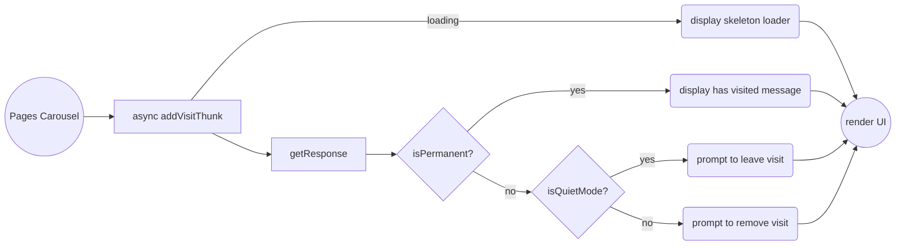
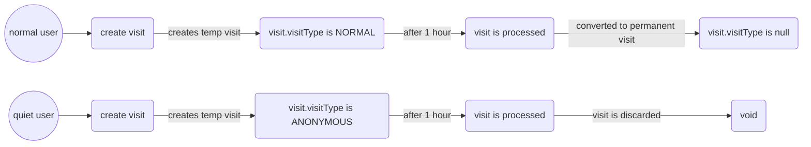

# Visits

## How visits work

When a carousel page is turned. We automatically leave a visit. If the user is in quiet mode, we still make the api call to leave a visit. The visit service is smart enough to discard these "ANONYMOUS" quiet mode visits. If we turn back to a carousel page we visited, we'll still fire the same API call. As long as there is a temporary visit, it will return the existing temp visit. 

## Rules 

### Can visit

A user can visit another user whenever they want. Just fire the visit. If we already have a temporary visit in flight, the call to create will return the existing temporary visit. The graphql api is designed to manage all the possible states for the visits also there is a validation for avoiding the generation of a new visit if a previos one has been generated in the previous 7 days, if that is the case, the graphql api will return the previous data.
The graphql api can return these possible states for visitType:
- NORMAL: This visit will be automatically updated after an hour to PERMANENT
- ANONYMOUS: Can be updated to change the visitType to NORMAL
- PERMANENT: If permanent, the user could leave a visit only after a period of 7 days
- DELETED: This is just informative after deleting a visit

### Loading state

When the async addVisitThunk is fired, the us should go into a loading state. When resolved show the proper UX state. We use https://github.com/alexZajac/react-native-skeleton-content for loading content. 

### Quiet mode

We test if the user is in quiet mode, by adding the visit. A temporary visit is created, and the returned object lets the UI know if the user is in quiet mode. 

