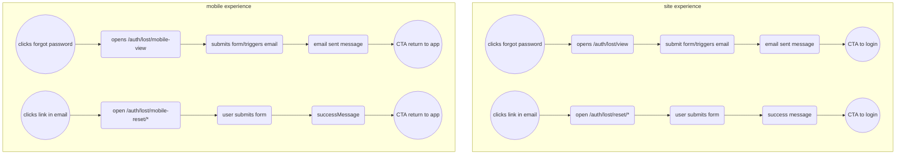

# Forgot Password

Forgot password opens an in app `SFSafariController`.  This controller functions like an iframe, that is embedded in a modal. This controller can pull in web content. The forgot password flow will reuse as much of site's forgot password functionality as possible.

For the mobile experience, it's important that these pages are optimized for the mobile expereince. That means different backgrounds, and no footer. Calls to action to return to the app, should close the safari controller. 

